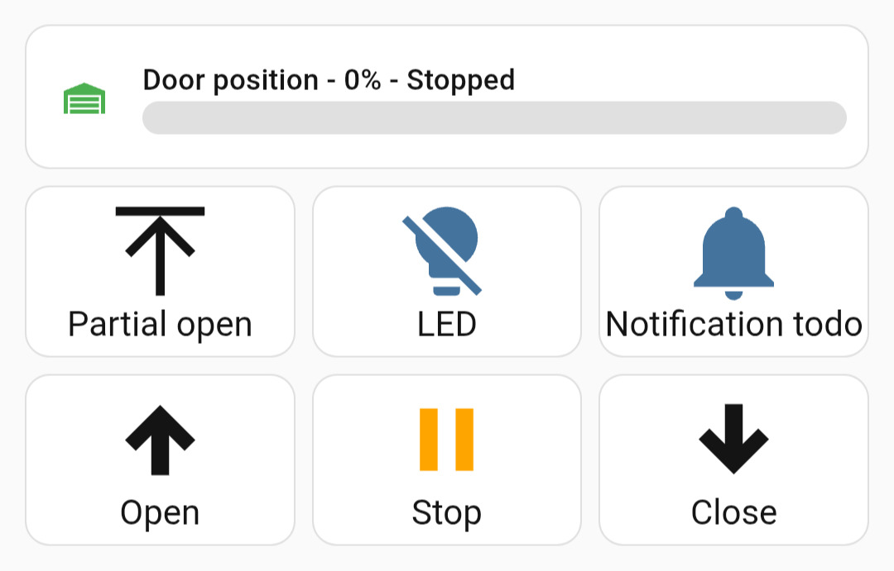
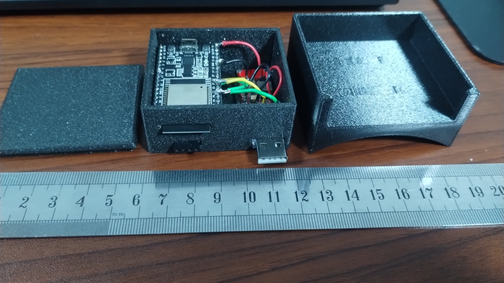
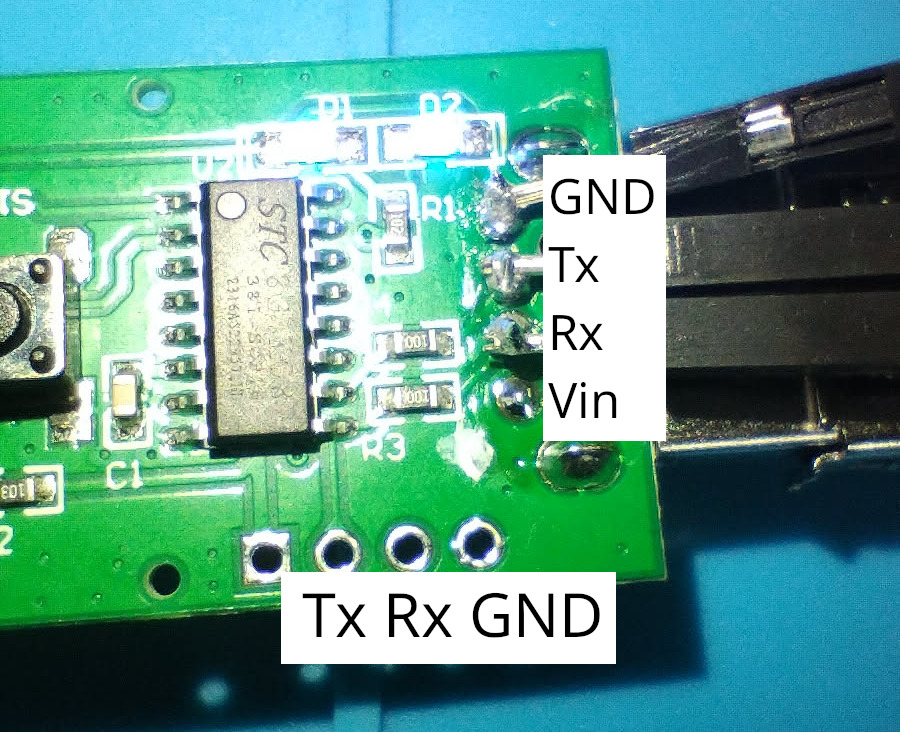
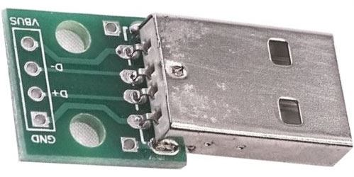
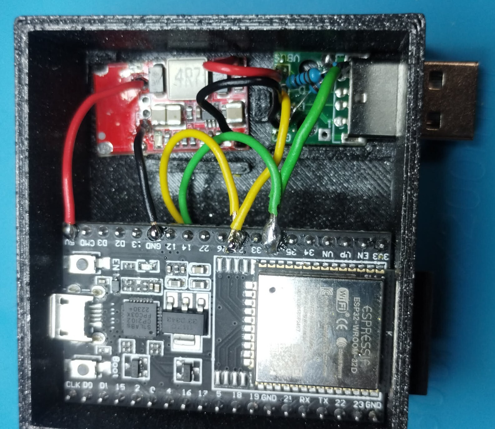
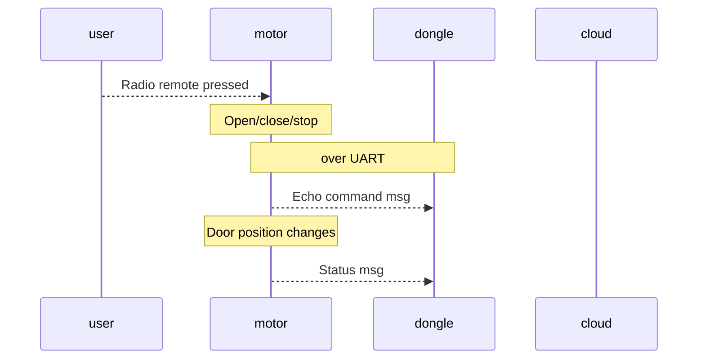
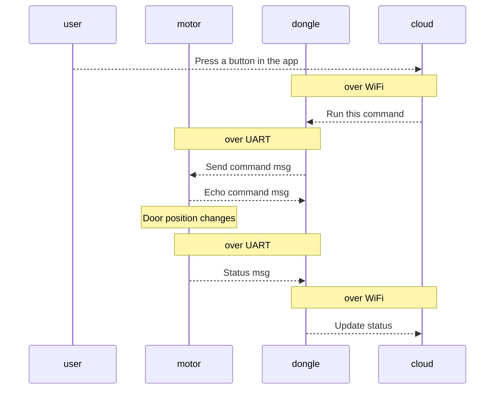

# About
A standalone device used to control the garage motor unit from Forcedoor.
It replaces their WiFi dongle, which is controlled via their F-LinX app.

## Features
Full feature parity with the original F-LinX / Noru app:
- Send commands: Open / Stop / Close / Partial Open (ventilation) / LED ON / LED OFF
- Receive full status: door position 0-100%, direction, LED state, motor load, cycle counter
- Cover entity with position control (open to X%)
- Auto-close timer (configurable 0-60 min)
- Motor load monitoring (useful for obstacle detection diagnostics)
- Native integration into Home Assistant

How the controls **can** look like in your Home Assistant


Entities exposed:
- Cover - Garage (open/close/stop + position slider)
- Buttons - Open, Stop, Close, Partial Open
- Light - LED
- Sensors - door position %, motor load, motor cycle counter
- Binary sensor - door moving
- Text sensor - current operation (Opening, Closing, Stopped)
- Number - auto-close timer (minutes)

How the finished system looks like - third part is a mounting bracket.
Just connect the motor unit with a USB extension.

The source for the CAD files is in the repo.


## Preparation
The USB interface is used only for physical conneciton. It does not communicate any USB protocol. In fact, it behaves against the USB standard:
- 24V instead of 5V
- on the data pins, there's 5V TTL logic (Rx and Tx), not a standard USB differental comm

Note it's possible I may have mixed up Rx/Tx on the bottom of the image, if so just flip the cables.

As the voltage is 24V, don't plug in a random USB device into the motor unit's USB female socket, you will burn it.

As part of the prep I would recommend to:
1. Using a multimeter, measure there's really 24V on Vin/GND



If there's 24V you can skip to building the system, or continue with prep of debug probes:
1. Solder some duponts onto the debug outputs in the picture below - on the empty marked slots
2. Connect a TTL-USB adapter to those pins and linten

### Components

Components you will need:
- USB male module, which breaks out the 4 pins on the board
- A step-down module from 24V to 5V - mine came with a female USB I have desoldered 
- 5k and 10k resistors for a voltage divider on our Rx (5V TTL logic down to ~3.1V)
- Some cables and soldering skillz
- An ESP32 board. Mine used was ESP32-WROOM-32D DevKitC. You can use smaller if you have it.

Regarding the firmware:
- Ability to flash an ESP32 with Esphome firmware
     - Steps how to do this on Linux are below. I dont know other systems.
- For debugging/testing, a TTL-USB adapter

### Testing
Solder some duponts on the USB male module and you can try to send some commands manually from your machine, using the TTL-USB adapter.

Example of the USB module:


- VUSB has 24V
- D- is Rx (of our device)
- D+ is Tx (of our device)
- GND

Connect your TTL-USB's ground with the USB's ground, Tx goes to D+, and you should be able to send some commands. See bottom of the page how to do that.

I have not tested this on another unit, but I would bet the protocol is the same, since their WiFi dongle is probably universal.

The original dongle is manufactured by **Noru** and runs an ESP32-C3 with custom firmware (not standard Tuya). The UART protocol ("protov1") is fully reverse-engineered - see [PROTOCOL.md](./PROTOCOL.md) for complete details.

## Build

A detailed look at the main box:


Components you will need:
- USB male module, which breaks out the 4 pins on the board
- A step-down module from 24V to 5V - mine came with a female USB I have desoldered 
- 5k and 10k resistors for a voltage divider on our Rx (5V TTL logic down to ~3.1V)
    - it's recommended so you dont fry your esp's GPIO with 5V
- Some cables and soldering skillz
- An ESP32 board. Mine used was ESP32-WROOM-32D DevKitC. You can use smaller if you have it.

The extra extra yellow and green cables in the image are for debug dupont probes I have broken out of the box (below the esp32 antennta), not necessary.

- Vusb, GND goes to the step-down
- The step-down module powers the ESP32 with 5V
- Rx and Tx are connected to pins configured in your YAML.

For the Rx voltage divider:
```
---[5k]---+---GPIO
          |
        [10k]
          |
         GND
```

On GPIO you should now have close to 3V


### Testing on Linux

- Make sure your TTL is set to baud rate 115200
- If you use Nix, you can use the flake in this repo to pull dependencies. Otherwise you need to get the tools based on your system's capabilities
    - `nix develop` to get a shell with the packages needed

To send commands via serial:
```bash
echo "23074100006b0d" | xxd -r -p | tio --baudrate 115200 /dev/ttyUSB0
```
This is the command for Open. See the [`garage.yaml`](./config/garage.yaml) for all commands.

To receive status messages via serial
```bash
tio --baudrate 115200 /dev/ttyUSB0 | xxd
```

## Firmware
Via ESPHome.

### Configuration
Before flashing you need to configure your own YAML.

Probably the only thing needed is to create a `secrets.yaml` next to `garage.yaml`

Contents:
```yaml
wifi-1-ssid: "your-first-wifi-ssid"
wifi-1-pw: "your-first-wifi-password"
wifi-2-ssid: "your-second-wifi-ssid"
wifi-2-pw: "your-second-wifipassword"
encryption: "unique-encryption-key-generated-on-esphome-docs-page"
```

Conents of this file are used by ESPHome while building the yaml configuration.

Notes
- I used two WiFi networks - one to develop at home and second where it's deployed. If you need only one, also adjust the `garage.yaml`
- Use a unique encryption key, the [EPSHome page randomly generated one for you](https://esphome.io/components/api/)
- Never store the `secrets.yaml` on Git or publicly. If doing so, encrypt it via `age` or something.


### Flashing

My recommendation is to use an isolated docker environment, using the docker compose in this file.

To flash a device for the first time, connect it to your system via USB.
If you dont have an ESP32 with onboard USB adapter, you may need to get one, depends on the model.
Some boards may need to be brought into flashing mode, depends on the model.

```
sudo chown $user /dev/ttyusb0 # for convenience
# or, add yourself to group `dialout`
```

Fire up the esphome docker environment
```
docker compose up -d
```

Flash it
```
docker exec -it esphome bash -c "esphome run garage.yaml --device 10.0.20.7"
```

To re-flash it using OTA and you know the IP address of the device
```
docker exec -it esphome bash -c "esphome run garage.yaml --device 10.0.20.7"
```

To tail the logs:
```
esphome logs <yaml>
```

### Integrate into Home Assistant
Using the ESPHome integration:
1. input the IP address of your device:
    - find in your router config
    - or you can use mDNS if the network setup allows - `garage-door.local`
2. Insert your encryption key
That's it - you can test the buttons in the ESPHome configuration details and then set up your buttons / fancy UI


## Details how the wifi dongle works 

### Scenarios

#### User presses a button on the radio remote
Same scenario applies if the physical button (wall switch) is pressed,
just the `Echo command msg` has different payload


#### Send a command from the cloud app



### Protocol over UART

Each message follows this format:
```
[HEADER] [LENGTH] [MSG_TYPE] [PAYLOAD...] [CRC] [0x0D]
```

| Field | Size | Description |
|-------|------|-------------|
| HEADER | 1 byte | `0x23` for TX (ESP->Motor), `0x40` for RX (Motor->ESP) |
| LENGTH | 1 byte | Total frame length (including header, length, CRC, footer) |
| MSG_TYPE | 1 byte | `0x41` for commands, `0x49` for status, etc. |
| PAYLOAD | variable | `LENGTH - 4` bytes |
| CRC | 1 byte | Sum of all preceding bytes & 0xFF |
| FOOTER | 1 byte | Always `0x0D` |

#### TX Commands (ESP -> Motor)

Standard 7-byte frame: `[0x23] [0x07] [0x41] [CMD] [0x00] [CRC] [0x0D]`

| CMD | Action |
|-----|--------|
| `0x00` | Open |
| `0x01` | Stop |
| `0x02` | Close |
| `0x03` | Partial open (ventilation) |
| `0xF0` | LED on |
| `0xF1` | LED off |

#### RX Status (Motor -> ESP)

17-byte frame: `[0x40] [0x11] [0x49] [14 bytes] [0x0D]`

After header, the 14-byte payload:

| Offset | Name | Description |
|--------|------|-------------|
| 0 | MSG_TYPE | `0x49` |
| 1 | DIRECTION | `0x00`=Opening, `0x01`=Stopped, `0x02`=Closing |
| 2 | LED_STATE | `0xF0`=ON, `0xF1`=OFF |
| 3-4 | CYCLE_COUNT_1 | Motor cycle counter (uint16 big-endian) |
| 5-6 | CYCLE_COUNT_2 | Motor cycle counter #2 (always CC1+1) |
| 7 | CONTROLLER_ID | Hardware ID, constant `0x74` |
| 8 | ENCODER_POS | Raw encoder position (uint8, wraps around) |
| 9 | RESERVED | Always `0x00` |
| 10 | MOTOR_LOAD | Current/torque indicator. Higher when opening (~45), lower when closing (~19) |
| 11 | POSITION | Door position 0-100% |
| 12 | MOVE_FLAG | `0x00`=moving, `0x02`=stopped |
| 13 | CRC | Checksum |

For the full protocol documentation including all RX message types (command ack, config, pairing, temperature, etc.), see [PROTOCOL.md](./PROTOCOL.md).

